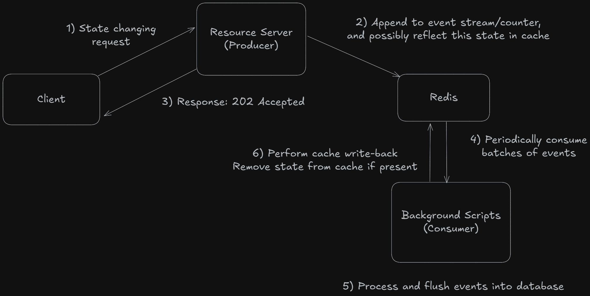

# Index
1) [System Behaviour](#system-behaviour)
   ---
   i) [Event Streams](#1-event-streams)
   
   ii) [Intents](#2-intents)
   
   iii) [Pagination](#3-pagination)
   
   iv) [RTBF](#4-rtbf---right-to-be-forgotten)
   
2) [API Reference](#api-reference)
   ---
   i) [Blueprint: users](#blueprint-users-url-prefix-users)
   
   ii) [Blueprint: posts](#blueprint-posts-url-prefix-posts)
   
   iii) [Blueprint: comments](#blueprint-comments-url-prefix-comments)
   
   iv) [Blueprint: animes](#blueprint-animes-url-prefix-animes)
   
   v) [Blueprint: forums](#blueprint-forums-url-prefix-forums)
   
   vi) [Blueprint: misc](#blueprint-misc)


# System Behaviour
This section will cover common patterns/abstractions that are present in many endpoints, agnostic of whichever resources they may relate to.

### 1) Event streams
**1.1) Reason**: In any system that wishes to service a large number of requests at any time, it needs to minimize latency for each endpoint. For this backend, like many others, the actual state is shared between Redis and Postgres, with a write-back policy for most endpoints. One way to significantly cut down on latency is to just **not bother with the database.** No matter how much the geniuses behind SQLAlchemy or psycopg2 optimize their libraries, at the end of the day a file operation will be magnitudes slower than any in-memory operation. This is simply a hardware characteristic.

**1.2) Working**: What I mean by "Not bothering" is to remove the responsibility of databsae writes from an individual endpoint. This is commonly achieved through an **event-driven architecture**. Here, we'll need a fast but reliable way of maintaining a queue of events, and a non-blocking process to periodically flush these events into the database in big batches. This will reduce database write operations by orders of 1000 (batch size).

**1.3) Implementation**: Now in practice, as far as any endpoint is concerned, it has performed its duty of updating application state by simply enqueuing an event for later flushing or updating a counter in Redis. This event queue is implemented through various **Redis streams**. A stream will contain events for a particular type of action only. For example:
- The stream `INSERTIONS` is to insert records of strong entities (posts, comments, forums) into the database.
- The stream `SOFT_DELETIONS` is to mass update a batch of records to mark them as deleted
- The stream `USER_ACTIVITY_DELETION` is to mark a user as deleted, and also trickle the effects of account deletion onto a user's contributions

A Redis stream gives us the fastest possible way to maintain a distributed event queue, and with AOF enabled (or even very aggressive snapshotting) we can have reliability as well.

Under the package `resource_server.scripts.batch_workers`, there are many different Python scripts that are meant to be run as background jobs for consuming these events. Each script is responsible for 1 type of Redis stream, and hence for 1 type of database operation. The number of stream entries to be consumed and the frequency of consumptions can very easily be changed. All worker related configurations are stored in the same package inside `worker_config.json`.
Many of these workers also help in cleaning up intent flags (which I'll explain later) and in enforcing a cache write-back policy.

**1.4) Distributed counters:** I had mentioned updating a counter in Redis, and this is where distributed counters come in. For counters, performing an `UPDATE` query for each increment/decrement becomes wasteful since we are only changing an integer by 1 (or 2 in some cases) and using an entire query for such a simple operation.

Again, looking at many large-scale applications, we notice an intuitive pattern of having shared counters which are only periodically flushed into disk storage. With Redis, this becomes extremely easy. The way I have implemented this is by simply maintaining a hashmap for every resource-attribute pair, such as `posts:score` and `forum:posts`. Under these hashmaps, all we need to do now is maintain an updated resource's ID as the key and its current counter as the value. Redis has an `hincrby` to allow in-place updates of a hashmap key (Much to my surprise, if only I had read the docs completely I wouldn't have wasted my time implementing a pointer mechanic like a clown).

This is the only event-driven mechanic which does not use a Redis stream, but rather has these resource-attribute pairs written into the config file, based on which the worker atomically reads and deletes hashmaps, and persists the counters to Postgres. Atomicity here prevents even a single update from being deleted between reads and deletes.



### 2) Intents
**2.1) Reason:** An event-driven, eventually-consistent system sounds very nice, but eventual consistency can very easily lead to more eventual inconsistency. I believe it is best that I illustrate this with an example.

Suppose we have a POST endpoint that upvotes a given post. Since we have removed the responsibility of DB writes from individual endpoints, this action will lead to 2 Redis operations:
1) Updating a global counter for this post's score under the `posts:score` hashmap
2) Queueing an entry into the `WEAK_INSERTIONS` stream for the assosciation record `post_votes` since this is a many-to-many relationship.

Now let's assume that both of our workers for these 2 actions will perform the next DB flush in 10 seconds. Now, in these 10 seconds, what's stopping the client from sending another request to upvote this same post? If they do, our fancy little endpoint now faces **prosaic doom**.
This is because there exists no way for us to check if the user has upvoted the same post prior to this request, since the assosciated `post_votes` entry is not on disk yet. What happens now is that the endpoint wrongly allows this request to change application state, and performs the same pair of operations twice.
Even if the worker responsible for flushing `WEAK_INSERTIONS` stream entries into disk has an `ON CONFLICT DO NOTHING` clause to silently fail this duplicate record, what about our shared counter? The worker here simply flushes a number into a record based on a primary key. 

**2.2) Working:** We hence need an ephemeral way to maintain consistency until the database reaches a consistent state. This mechanism needs to be instantly consistent and distributed among all workers (And once again, Redis proves why it is the best human invention since wifi).

**2.3) Implementation:** For each action on a given resource by a given user, we can (ephemerally) write this action into Redis as a simple key-value pair. Once this event has actually been written into disk by a worker, that worker can also assume the role of cleaning up cache and deleting these pairs. Furthermore, we can set an expiry of 1 day on these entries.

Let's go back to our previous example, but this time our endpoint uses Redis as a source of truth first:
1) Client -> **POST /api/posts/123/votes?vote=1** (Assume 1 as upvote, 0 as downvote)
2) Endpoint processes this request
   i) Checks Redis for intent -> Miss
   ii) Falls back to a DB read -> No previous vote found
   iii) Incrmeents global counter for this post's score
   iv) Enqueues a new event into `WEAK_INSERTIONS` 
   v) **202 Accepted** <- Server
3) Client sends identical request again right afterwards
4) Endpoint processes this request
   i) Checks Redis for intent -> Hit!
   ii) Check this flag's value for a conflicting value (which in this case would be 1)
   iii) Value matches with conflicting value
   iv) **409 Conflict** <- Server
5) Client -> **POST /api/posts/123/votes?vote=0**
6) Endpoint processes this request
   i) Checks Redis for intent -> Hit!
   ii) Check this flag's value for a conflicting value (which in this case would be 1)
   iii) Value does not match, hence this request can be allowed
   iv) **202 Accepted** <- Server
   
  This mechanism not only keeps state consistent, but also allows clients to change their latest actions without requiring the database to first process their previous action

### 3) Pagination
**3.1: Preface:** Pagination is a common theme in any REST API, but it gets tricky once we try to cache paginated result sets. This subsection is much smaller than its contemporaries, but I feel that it is important to illustrate the pagination logic used here since its common in many GET endpoints.
**3.2) Implementation:** Paginated result sets are cached using the parent resource's cache key, and the decoded cursor (And possibly additional params such as sort options). Each cached entry contains the cache keys for the resources within the paginated set, an `end` flag to indicate presence of more entries, and a cursor for the next paginated set's key name. In this way, paginated results work like singly linked lists (Never thought I'd use DSA in Redis, but here we are).
Upon fetching the cached result, it is the caller's responsibility to fetch the actual resources too, and resolve any partial cache misses (Although this too is handled by `auxillary.utils.fetch_group_resources`)

Whenever a paginated result set is cached, the actual posts have a longer TTL than the set containing their keys (see `auxillary.utils.cache_grouped_resource`)

### 4) RTBF - Right To Be Forgotten
**4.1) Reason:** In a platform like Reddit, you will notice that a user's posts and comments are still exposed publicly even when they have deleted their account. This is seen frequently when people try to be edgy and cool, but end up being waterboarded with downvotes and backlash, leaving only a `u/deleted` behind. I thought that this was a very neat mechanic, and decided to spin up something similiar
**4.2) Implementation:** The User model has a `rtbf` boolean attribute that defaults to False. Upon account deletion, this attribute is passed to the responsible stream. When a user RTBF disabled decideds to delete their account, their posts and comments are still exposed publicly, but with their usernames being hidden.
For a user with RTBF enabled, we take this a step further. Each contribution that a user might make, such as posts and comments, has a an `rtbf_hidden` flag as a sort of soft deletion. This hides all contributions of a user once they have deleted their account, while also allowing them to recover their account within the recovery period and make all these resources publicly availabale again.

# API Reference
This section covers all endpoints present in the resource server, segregated by their parent blueprints.

## Blueprint: users (url prefix: `/users`)
Routes under this blueprint are all concerned with actions regarding the resource `users`, which is modelled by the `User` SQLAlchemy model. Related tables: `password_recovery_tokens`

### Endpoints
```http
GET /api/v1/users/<user_id>
```
#### Authentication: !Required
#### Path Parameters
* `user_id:` The ID of the user record to fetch
#### Internal Working
Very straightforward, follows the typical pattern of cache reads and falling back to DB on misses. Lastly, the fetched user metadata is enriched with distributed counters for attributes such as `aura`, `posts`, and `total_comments` if present.

#### Response JSON
Status: 200 OK
```json
{
  "user" : {
    "id" : 123,
    "username": "foo123456789",
    "aura": 7345,
    "posts": 256,
    "comments": 781,
    "epoch": "2022-01-20T16:45:09.163811",
    "last_login": "2025-06-20T12:38:26.152592"
  }
}
```

#

```http
POST /api/v1/users/
```
#### Authentication: !Required
Create a new user account
**Note:** See `auth_server.blueprint_routes` for more details on how this endpoint relates to JWT authentication.
#### Request JSON:
```json
{
  "username" : "foo123456789",
  "password" : "topsecretpassword",
  "email" : "foo123@domain.tld"
}
```
#### Internal Working:
**This endpoint is meant to work in coordination with the auth server as part of the authentication flow.**
All actions are performed completely synchronously, this includes any possible hard deletions of soft deleted user records. This happens when a soft deleted account with the same username, email address, or both exists. There can also be 2 accounts, one with the email address and the other with the username. This violates the unique contraint on the `users` table on usernames and emails (individual, not composite). 

In these cases, it is acceptable to hard delete these records before their 14 day recovery period to allow a new record with their credentials to be created. The user deletion endpoint explicitly mentions this exception to the recovery policy as well. The provided password is hashed and salted, and the new `users` record is inserted into DB. This all happens synchronously, as I believe actions regarding account creation (and even deletion, password recovery, and so on) are much more time-sensitive and its fine to incur some exceptions to our overall event-driven philosophy.

#### Response JSON
Status: 201 Created
```json
{
  "message" : "Account created",
  "sub" : "foo123456789",
  "sid" : 150370,
  "email" : "foo123@domain.tld"
}
```
Notice that the `sub` and `sid` keys in the response JSON are public claims in JWTs. This is intended to provide the auth server with the necessary user metadata to issue tokens. Other claims, such as `iat`, `exp`, `jti` are determined by the auth server with no dependencies on the resource server. For token issuance, see the auth server's README or see the `auth_server.token_manager.TokenManager.issueRefreshToken` method.

# 
```http
POST /api/v1/users/login
```
Log into an existing user account
#### Authentication: !Required
#### Request JSON
```json
{
  "identity" : "foo123456789",
  "password" : "topsecretpassword"
}
```
#### Internal Working
`identity` can be either username or password, and the distinction is done server-side (since usernames are not permitted to have '@'). Based on which attribute identity relates to, the `users` table is read to check for user existence. After this, cache is also consulted to check for this user's status. This is to disallow logins into accounts that are pending deletion.

Next, the password hash of this account is checked against the hashed value of the provided password. Upon success, the `last_login` attribute is updated to current time

#### Response JSON
Status: 200 OK
```json
{
  "message" : "authorization successful",
  "sid" : 150370,
  "sub" : "foo123456789"
}
```
Again, `sub` and `sid` claims are returned as part of a larger auth flow in coordination with the auth server (see `auth_server.blueprint_routes.login`)
#
```http
PATCH /api/v1/users/<user_id>/enable-rtbf
PATCH /api/v1/users/<user_id>/disable-rtbf
```
Toggle the RTBF flag on a user account.
#### Authentication: Required
#### Path Parameters:
* `user_id:` Unique user ID of the record to update (you would have never guessed)

#### Request JSON
```json
{
  "confirmation" : "foo123456789"
}
```

#### Internal Working:
On top of authentication, these endpoints also require the `sid` claim in the attached JWT in cookies to match the `user_id` path parameter. Furthermore to prevent accidental updates, it is required to also enter the username of the target record. Updates are done in the same HTTP cycle synchronously.

#### Response JSON
Status: 200 OK
```json
{
  "message" : "RTBF Enabled"
}
OR 
{
  "message" : "RTBF Disabled"
}
```
#

```http
DELETE /api/v1/users/<user_id>
```
#### Authentication: !Required (Done explicitly and not through JWT)
#### Path Parameters
* `user_id:` Unique user ID of the record to delete

#### Request JSON
```json
{
  "username" : "foo123456789",
  "password" : "topsecretpassword"
}
```

#### Internal Working
An additonal check in this endpoint is that if a JWT is present in request cookies, it is also checked. This involves only checking the `sid` and `sub` claims with the `user_id` path param and the `username` value in request JSON respectively.

Based on `user_id`, the user record is fetched from DB. This record's username attribute is compared with the `username` field in request JSON. Most importantly, the hashed password is compared with the hashed value of the provided `password` value.

After these checks, a final check occurs in cache to check the status of this account, and to stop duplicate deletions for accounts that are pending deletions.

Once all checks are passed, the flag for this user is updated to indicate pending deletion. After async operations, a DELETE request is also sent to the auth server to purge this account's token family (if present)

#### Async effects
* Appending to `USER_ACTIVITY_DELETIONS` stream
* Enqueuing a deletion notice email to the account's email

#### Response JSON
```json
{
  "message" : "account deleted succesfully",
  "username" : "foo123456789",
  "time_deleted" : "2025-06-20T12:24:27.703261"
}
```
#
```http
POST /api/v1/users/<user_id>/recovery
```
Recover a deleted account if its within the 14 day recovery period (exception being the one mentioned in user registration)
#### Authentication: !Required (Also quite impossible to be authenticated as a deleted account)
#### Request JSON
```json
{
  "identity" : "foo123456789",
  "password" : "topsecretpassword"
}
```
#### Internal Working
Similiar to the login endpoint, request JSON is validated and the target user account is fetched from DB (through `user_id` this time). If the fetched record's `time_deleted` attribute is past the recovery window, then this request is rejected. Furthermore, the hashed password is checked against the password provided. (*Although it is still possible for a deleted user to request password recovery*)

Similiar to account deletion logic, a lock is set to prevent duplication, and state in Redis is checked for the same reason. The only synchronous actions here are writing the latest intent on this account as recovery, and performing a write-through for this account.

#### Async Effects
* Append to `USER_ACTIVITY_RECOVERY` stream
*  Enqueue an email to the recovered account's email address to notify account recovery

#### Response JSON
```json
{
  "message" : "Account recovered succesfully",
  "user" : {
    "id" : 123,
    "username": "foo123456789",
    "aura": 7345,
    "posts": 256,
    "comments": 781,
    "epoch": "2022-01-20T16:45:09.163811",
    "last_login": "2025-06-20T12:38:26.152592"
  },
  "_links" : {"login" : {
    "href" : "/api/v1/users/login"
  }}
}
```
#
```http
POST /api/v1/users/recover-password
```
Recover password for an account
#### Authentication: !Required
#### Request JSON
```json
{
  "identity" : "strawhat_1234" 
}
```
#### Internal Working:
The initial validation, and fetching user record flow is the same as the login endpoint. Upon success, a temporary url is created through a UUID hex value and the current time. This will be used as the temporary URL to actually change the password. This url is hashed and stored in the database. Any pre-existing tokens with `user_id` values equal to the fetched user record are deleted.

#### Async Effects:
* Enqueues an email containing this temporary URL

#### Response JSON
```json
{
  "message" : "An email has been sent to account"
}
```
#
```http
PATCH /api/v1/users/update-password/<temp_url>
```
Update a password after requesting password recovery
#### Authentication: !Required
#### Path Parameters:
* `temp_url:` The URL sent via the email in response to a POST request to `/api/v1/users/recover-password`
#### Request JSON
```json
{
  "password" : "newtopsecretpassword",
  "cpassword" : "newtopsecretpassword"
}
```
#### Internal Working:
The URL is hashed and checked against the database in `password_recovery_tokens` for a match. If the token has not been expired, then a new password hash and salt pair is produced from the given password and the account is instantly updated. Lastly, the token is deleted from the database.

#### Response JSON
Status: 200 OK
```json
{
  "message" : "password updated succesfully",
  "_links" : {"login" : {"href" : "/api/v1/users/login"}}
}
```

## Blueprint: posts (url prefix: `/posts`)
Routes under this blueprint are all concerned with actions regarding the resource `posts`, which is modelled by the `Post` SQLAlchemy model. Related tables: `post_votes`, `post_saves`, `post_reports`

### Endpoints

```http
  POST /api/v1/posts
```
Creates a new post. The request is processed asynchronously via a Redis stream. The post may take a short time to become visible, as a cache write is impossible until the database ID is determined

#### REQUEST JSON
``` JSON
{
    "forum" : 3969,
    "title" : "foo",
    "body" : "foooooooooo"
}
```
- Leading and trailing whitespaces are removed from title and body before any validation occurs. 

#### Async effects:
Upon successful validation, the post is enqueued to the `INSERTIONS` Redis stream.

Furthermore, post creation also involves incrementing 3 distributed counters, which are:

- Parent forum's total posts
- Author's total posts
- Author's aura

Since even this is done asynchronously by batch workers, as far as this endpoint is concerned, a successful call to `update_global_counter` means the updation is handled.

#### Response JSON
Status: 202 Accepted
``` JSON
{
    "info": "It may take some time for your post to be visibile to others",
    "message": "post created",
    "time_posted": "2025-06-18T16:01:26.268528"
}
```
## 

```http
GET /api/v1/posts/<post_id>
```
Authentication: Optional, but affects the returned information

Fetches the public metadata of a post by ID. If the authenticated user includes the query parameter `fetch_relation=true`, the response will include post-specific relation data (save status, vote status)

#### Query Parameters:
`fetch_relation (Optional):` If authenticated, whether to query the user's relation (saved, voted). Requires authentication through JWT

#### Path Parameters:
- `post_id: (Required)` The unique ID of the post to fetch

#### Internal Working
Attempts to serve the post from Redis cache.
If not found, fetches from DB (`Post INNER JOIN User`).

If post is marked `deleted=True`, `rtbf_hidden=True` or simply not found, a 404 is returned and cache is updated with ephemeral timing to indicate resource non-existence.

If author is deleted, then the username field is anonymized

If fetch_relation is requested and user is authenticated:
- Checks if the post is saved/voted by the user.
- Determines if the user is the post’s author.
- Caches save/vote relation in Redis with ephemeral TTL.

#### Response JSON
Status: 200 OK
```json
{
    "post": {
        "author_id": 1,
        "body_text": "They need to make a proper Berserk anime",
        "closed": false,
        "comments": 12,
        "epoch": "05/06/25, 13:15:06",
        "forum": 4077,
        "id": 2114,
        "saves": 10,
        "score": 123,
        "title": "Justice to Berserk"
    }
}
```
# 
```http
PATCH /api/v1/posts/<post_id>
```
#### Authentication: Required
Change the body, title, and/or closed status of an existing post. This required the `sid` claim in the attached JWT to be that of the post author, else a `403 Forbidden` is returned
#### Path Parameters:
- `<post_id>:` Post ID for the post that needs to be updated

#### Internal Working
Requires atleast one of the mutable attributes of the post to be specified.

Post existence and ownership can very quickly be verified through a single cache query. Only on a cache miss is a DB read performed on `posts` to match the `author_id` column with the JWT's `sid` claim. 

Upon verification, the changes are persisted to DB through an `UPDATE` query (Although this may be reworked to an asynchronous stream append in the future) and the updated post's public metadata is written in cache.

#### Response JSON
Status: 200 OK (Subject to possible change to 202 Accepted)
``` JSON
  {
    "message": "Post edited",
    "post": {
        "author_id": 1,
        "body_text": "This is the edited body of this post",
        "closed": true,
        "comments": 0,
        "epoch": "05/06/25, 13:15:06",
        "forum": 4077,
        "id": 2114,
        "saves": 0,
        "score": 0,
        "title": "fooooooooooooooo"
    }
}
```
# 

```http
DELETE /api/v1/posts/<post_id>
```
#### Authentication: Required
Permanently delete a specified post by its unique ID. On top of authentication, this endpoint requires the user to either be the owner of the post, or be an admin in the post's parent forum.

#### Query Parameters:
- `redirect:` Value isn't read, but if this param is present then the url of the deleted post's parent forum is included in the JSON response.

#### Path Parameters:
- `<post_id>:` Post ID for the post that needs to be deleted.

#### Internal Working
Cache is first consulted to ensure that:
- Post exists (non-existence announcements) -> `404 Not Found`
- Post hasn't been already queued for deletion (through the intent flag) -> `410 Gone`
- A lock for this action isn't in place -> `409 Conflict`

On cache miss, a single DB read needs to be performed to check post status.

--Note that posts hidden by RTBF can still be deleted.--

After confirming post existence, the second check involves permissions regarding this post (as mentioned above).
Lastly, a lock is set (with `NX` to avoid races/duplicates) before beginning the actual deletion. 

Here, the only synchronous action would be the writing of this post's deletion intent into cache

#### Async effects
- posts counter for parent forum is decremented
- total_posts counter for author is decremented
- A deletion entry is appended to the `SOFT_DELETIONS` Redis stream

Finally, the lock is released.

#### Response JSON
``` JSON
{
    "message": "post deleted",
    "post": {
        "author_id": 1,
        "body_text": "foooooo4oooo",
        "closed": true,
        "comments": 0,
        "epoch": "05/06/25, 13:15:06",
        "flair": null,
        "forum": 4077,
        "id": 2114,
        "saves": 0,
        "score": 0,
        "title": "fdsdsdsdsdsdsoo"
    },
    "redirect": null
}
```

# 
```http
POST /api/v1/posts/<post_id>/votes
```
#### Authentication: Required
Cast an upvote or a downvote to a given post

#### Query Parameters
- `type`: --Required--, specify downvote (0) or upvote (1).

#### Path Parameters:
- `<post_id>:` Post ID for the post to be voted on.

#### Internal Working
Cache is initially consulted to verify post existence, as well as to try and check the user's latest intent with the post regarding vote status. This allows quick exits on conflicting intents or post non-existence/deletion.

If cache pre-checks are passed, a lock is set to prevent race conditions and duplicate actions. 

In case of partial/full cache misses (post, intent), a single DB read is required. This can either be a simple `SELECT` query for a single resource, or with an additional `OUTER JOIN` clause in case of a complete cache miss. 

Based on previous vote/intent of the user, a delta value is updated to reflect the changes in the post's score when shifting from the user's previous intent to their incoming intent (e.g. A user who has previously downvoted a post may upvote it, in which case the post's score must be updated by 2 and not 1).

When performing the actual vote action, the only synchronous task is the writing of the new incoming vote into cache as the new latest intent.

#### Async effects:
- Updating distributed counter for post's score with delta
- Updating distributed counter for post's author's aura with delta
- Appending a new entry into the `WEAK_INSERTIONS` Redis stream for assosciation table `post_votes`

### Response JSON
Status: 202 Accepted
```json
{
  "message" : "Vote Casted!"
}
```

# 
```http
DELETE /api/v1/posts/<post_id>/votes
```
#### Authentication: Required

Remove a casted vote from a post

#### Path Parameters:
- `<post_id>:` Post ID for the post from which a vote is to be removed.

#### Internal Working:
Cache is initially consulted to try and check the user's latest intent with the post regarding vote status, as well as check post existence.

--Note:-- Although a user is not allowed to cast a vote on a non-existing/deleted post, a user is still allowed to remove their vote from a post that is queued for deletion 

Similiar to this endpoint's POST counterpart, A lock is set to prevent race conditions and duplicate actions. 
In case of partial/full cache misses (post, intent), a single DB query is performed similiar to this endpoint's POST method. 

Based on previous vote/intent of the user, a delta value is updated to reflect the changes in the post's score when shifting from the user's previous intent to their incoming intent (either +1 or -1)

When performing the actual unvote action, the only synchronous task is the writing of the vote into cache as the new latest intent.

#### Async effects:
- Update score of post
- Update aura of post's author
- Queue deletion of the existing `post_votes` record to `WEAK_DELETIONS` Redis stream

#### Response JSON
Status: 202 Accepted
``` JSON
{
  "message" : "Removed vote!",
  "delta" : delta
}
```
--delta can be either +1 or -1--

# 

``` HTTP
POST /api/v1/posts/<post_id>/saves
```
#### Authentication: Required

Save a post by its ID (the sky is blue)

#### Path parameters:
- `<post_id>:` Post ID for the post to save.

#### Internal Working:
Cache is initially consulted as a quick precheck, similiar to the internal working of casting a vote.

This check involves checking existence, as well as checking if this post is pending deletion.

Based on type of cache miss (if any), DB is read once to confirm existence of the post and to check if the post is already saved (i.e. --latest intent--)

On passing all checks, the latest intent for this action is synchronously updated in cache

#### Async effects:
- Increments distributed counter for saves on the post
- Increments aura of the post's author

#### Response JSON
Status: 202 Accepted
``` JSON
{
  "message": "Post saved!"
}
```
#
``` HTTP
DELETE /api/v1/posts/<post_id>/saves
```
#### Authentication: Required

Save a post by its ID (the sky is blue)

#### Path parameters:
- `<post_id>:` Post ID for the post to unsave.

#### Internal Working:
Cache is initially consulted as a quick precheck, similiar to the internal working of casting a vote.
This check involves checking existence, as well as checking if this post is pending deletion.


--Note--: Even if a post is pending deletion, a user is still allowed to remove their casted vote from it.

Based on type of cache miss (if any), DB is read once to confirm existence of the post and to check if the post is actually saved (i.e. --latest intent--)

On passing all checks, the latest intent for this action is synchronously updated in cache

#### Async effects:
- Decrements distributed counter for saves on the post
- Decrements aura of the post's author

#### Response JSON
Status: 202 Accepted
``` JSON
{
  "message": "Removed from saved posts!"
}
```

#
``` HTTP
POST /api/v1/posts/<post_id>/reports
```
#### Authentication: Required

Report a post

#### Path parameters:
- `<post_id>:` Post ID for the post to save.

#### Request JSON
```json
{
  "desc" : "Free speech is cool and all, but we can't allow an opinion this bad",
  "tag" : "other"
}
```
#### Internal Working:
This endpoint forbids a post from being reported for the same reason twice. For possible reasons for reporting any resource, see `resource_server.models.AdminRoles` enum.
This check is first done through cache, and on miss a DB read is required to prevent a user from reporting a post twice for the same reason.

Synchronous effect of this action is a simple write to Redis about the intent of this action, to prevent duplicate reports until this request is flushed to DB

#### Async effects:
- Increments distributed counter for reports of the post
- Queue an insertion entry for `post_reports` into the Redis stream `WEAK_INSERTIONS`

#### Response JSON
Status: 202 Accepted
``` JSON
{
  "message": "Post reported!",
  "reason" : "other",
  "description" : "Free speech is cool and all, but we can't allow an opinion this bad",
  "time_reported" : "2025-06-19T15:46:16.041748"
}
```
#

``` HTTP
GET /api/v1/posts/<post_id>/comments
```
Fetch paginated comments belonging to a post, optionally ordered by comment score or time (ascending/descending)
#### Authentication: !Required

#### Query parameters:
- `cursor:`: URL-safe, base-64 encoded cursor to indicate where to fetch the next set of comments from
- `sort:`: Optional option to sort fetched comments, defaults to chronological order. --Allowed values: time_asc, time_desc, score_asc, score_desc--. Values outside are of these 4 are ignored.

#### Path parameters:
- `<post_id>:` Post ID for the post to save.

#### Internal Working:
For paginated endpoints, see the section on [pagination](pagination-logic) to see the actual logic.

#### Response JSON
Status: 200 OK
```json
{
  "comments": [
    {
      "author_id": 1,
      "body": "test comment",
      "id": 8,
      "parent_forum": 4053,
      "parent_post": 2091,
      "time_created": "2025-04-10T15:48:06.377503",
      "username": "TENJIN"
    },
    {
      "author_id": 1,
      "body": "Goacos",
      "id": 7,
      "parent_forum": 4053,
      "parent_post": 2091,
      "time_created": "2025-04-10T15:47:14.092235",
      "username": "TENJIN"
    }
  ],
  "cursor": "AAAAAAAAAAAAAAAAAAAABw",
  "end": true
}
```

## Blueprint: misc
Routes under this blueprint are all concerned with actions that don't particularly concern one specific resource, or concern a resource that is not relevant enough to require a separate blueprint (ouch)

### Endpoints
``` HTTP
GET /api/v1/genres
```
#### Authentication: !Required
#### Internal Working:
Fetch all anime genres present in the database. Since genres are only written into database once at population (see module: `resource_server.scripts.genesis`), this is just returning an immutable mapping of available genres and their IDs, fetched from --Flask.current_app.config--

#### Response JSON
```json
{
  "Action": 220,
  "Adventure": 223,
  "Award Winning": 221,
  "Comedy": 229,
  "Drama": 224,
  "Fantasy": 227,
  "Horror": 235,
  "Mystery": 225,
  "Romance": 230,
  "Sci-Fi": 222,
  "Slice of Life": 239,
  "Sports": 228,
  "Supernatural": 226,
  "Suspense": 231
}
```
#
``` HTTP
POST /api/v1/tickets
```
Issue a new support ticket
#### Authentication: !Required, but affects internal behaviour

#### Request JSON
```json
{
  "email" : "foo123@domain.tld",
  "description" : "People keep bullying me because I like isekai"
}
```

#### Intenral Working
Based on whether the request is authenticated, the user_id field is filled or left blank. Email is required for this very purpose, to allow non-authenticated users to report issues (despite the resource being a "user ticket")

#### Async effects:
- Queue a stream entry into `INSERTIONS` for the table `user_tickets`

#### Response JSON
``` JSON
{
  "description": "People keep bullying me because I like isekai",
  "email": "foo@domain.tld",
  "message": "Your report has been recorded",
  "time": "2025-06-19T16:15:40.931274"
}
```

## Blueprint: comments (url prefix: '/comments')
Routes under this blueprint are all concerned with actions regarding the resource `comments`, which is modelled by the `Comment` SQLAlchemy model. Related models (assosciation tables) include: `comment_votes`, `comment_reports`

``` HTTP
POST /api/v1/comments
```
#### Authentication: Required
#### Request JSON:
```json
{
  "post_id" : 2080,
  "body" : "Fake news, we all know Homunculus is a CIA psyop"
}
```
#### Internal Working:
Cache is initially consulted to ensure that this post exists and is not pending deletion. On cache misses, a single DB read is required. This action requires the parent post to be open. After all checks are passed, the comment is added completely asynchronously

#### Async Effects:
- Increase distributed counter for `total_comments` of parent post
- Increase distributed counter for `total_comments` of the commenting user
- Increase distributed counter for `aura` of commenting user
- Append entry into Redis stream `INSERTIONS`

#### Response JSON:
```json
{
  "message": "comment added!",
  "author": "TENJIN",
  "body": "Fake news, we all know Homunculus is a CIA psyop",
  "time": "2025-06-19T16:28:43.861836"
}
```

# 

```http
DELETE /api/v1/comments/<comment_id>
```

#### Authentication: Required

#### Path Parameters
- `<comment_id>`: Unique ID of the comment to delete

Delete a comment by its ID. Requires the user to be the comment's author or a forum admin.

#### Internal Working:

- Checks comment existence and deletion status from cache or DB.
- Requires acquiring a Redis lock to proceed.
- Verifies permissions.
- Decrements `total_comments` from both the parent post and author.
- Queues deletion to `SOFT_DELETIONS` stream.
- Writes deletion intent to Redis.

#### Async Effects:

- Writes deletion intent into Redis cache.
- Appends to `SOFT_DELETIONS` Redis stream.

#### Response JSON:

Status: 202 Accepted

```json
{
  "message": "Comment deleted",
  "comment": { ... }
}
```

# 

```http
POST /api/v1/comments/<comment_id>/votes
```

#### Authentication: Required

Cast an upvote or downvote on a comment. Requires a `type` query parameter (`0` for downvote, `1` for upvote).

#### Query Parameters:

- `type`: Required. `0` for downvote, `1` for upvote.

#### Internal Working:

- Checks vote status via cache, prevents duplicate intent.
- Calculates `delta` based on previous intent.
- Deletes previous vote (if exists) before writing the new one.
- Sets Redis lock to avoid concurrent vote actions.
- Updates `score` of the comment and `aura` of the comment author.

#### Async Effects:

- Inserts to `WEAK_INSERTIONS` stream for `comment_votes`.

#### Response JSON:

Status: 202 Accepted

```json
{
  "message": "Vote casted!"
}
```

# 

```http
DELETE /api/v1/comments/<comment_id>/votes
```

#### Authentication: Required

Removes an existing vote (upvote or downvote) from a comment.

#### Internal Working:

- Checks existence and latest intent from Redis or DB.
- Requires lock acquisition before proceeding.
- Adjusts `delta` based on vote direction.
- Updates comment `score` and author `aura`.
- Appends deletion to `WEAK_DELETIONS` stream.

#### Async Effects:

- Appends to `WEAK_DELETIONS` stream.
- Stores deletion intent in Redis.

#### Response JSON:

Status: 202 Accepted

```json
{
  "message": "Vote removed!",
  "previous_vote": "upvote"
}
```

# 

```http
POST /api/v1/comments/<comment_id>/report
```

#### Authentication: Required

Report a comment for a specific reason. A user may only report once per reason (tag).

#### Request JSON:

```json
{
  "desc": "This comment is just not it",
  "tag": "spam"
}
```

#### Internal Working:

- Validates tag using `ReportTags` enum.
- Prevents duplicate reports for the same tag by the same user.
- Checks Redis and/or DB for prior reports.
- Sets intent and queues insertion into `comment_reports`.

#### Async Effects:

- Increments `reports` counter for the parent post.
- Appends to `WEAK_INSERTIONS` stream.

#### Response JSON:

Status: 202 Accepted

```json
{
  "message": "Comment reported!",
  "report": {
    "user_id": 42,
    "comment_id": 91,
    "report_tag": "spam",
    "report_time": "2025-06-19T17:02:01.378394",
    "report_description": "This comment is just not it"
  }
}
```

## Blueprint: animes (url prefix: `/animes`)

Routes under this blueprint are all concerned with actions regarding the resource `animes`, which is modelled by the `Anime` SQLAlchemy model. Related models include: `AnimeGenre`, `StreamLink`, `AnimeSubscription`.

# 

### Endpoints

```http
GET /api/v1/animes
```

#### Authentication: Not Required

Returns a paginated list of animes, with optional filtering by genre and search string.

#### Query Parameters:

- `cursor:` Optional. URL-safe cursor for pagination. Defaults to 0.
- `search:` Optional. Substring to search by title.
- `genre:` Optional. Filter by genre ID.

#### Internal Working:

Pagination is implemented using numeric ID cursors. If a genre is specified, the query joins on `AnimeGenre`. Otherwise, a regular filtered select is performed. A second query collects genre mappings for all fetched animes.

#### Response JSON:

Status: 200 OK

```json
{
  "animes": [
    {
      "banner": "assets/animes/Cowboy Bebop.jpg",
      "genres": [
        "Action",
        "Award Winning",
        "Sci-Fi"
      ],
      "id": 1,
      "title": "Cowboy Bebop"
      "mal_ranking": 47,
      "members": 3,
      "rating": 8.75,
      "synopsis": "Crime is timeless. By the year 2071, humanity has expanded across the galaxy ...",
    },
    ...
    ]
}
```
# 
```http
GET /api/v1/animes/<anime_id>
```

#### Authentication: Not Required

Fetch metadata of a specific anime by its ID. Includes genres and external streaming links.

#### Path Parameters:

- `anime_id:` The unique ID of the anime to fetch.

#### Internal Working:

The cache is first consulted for this anime. If the anime was previously marked non-existent, a 404 is raised. On a cache miss, a DB read is performed, and the result is composed of the anime’s base attributes, genres (via join on `AnimeGenre`), and any available streaming links (via join on `StreamLink`). The final object is written back to Redis.

#### Response JSON:

Status: 200 OK

```json
{
  "anime": {
    "banner": "assets/animes/Cowboy Bebop.jpg",
    "genres": [
      "Action",
      "Award Winning",
      "Sci-Fi"
    ],
    "id": 1,
    "mal_ranking": 47,
    "members": 3,
    "rating": 8.75,
    "stream_links": {
      "Crunchyroll": "http://www.crunchyroll.com/series-271225",
      "Netflix": "https://www.netflix.com/title/80001305",
      "Tubi TV": "https://tubitv.com/series/2052/cowboy-bebop-subtitled"
      },
    "synopsis": "Crime is timeless. By the year 2071, humanity has expanded across the galaxy ...",
    "title": "Cowboy Bebop"
  }
}
```

# 

```http
GET /api/v1/animes/random
```

#### Authentication: Not Required

Fetches a random anime's metadata

#### Internal Working:

A global list of random anime IDs is kept in memory. On each request, a random anime is popped and returned, with the cache refreshed when the list runs low. If none are found after retries, a fallback query is used to fetch the earliest anime. The fetched anime is not cached.

#### Response JSON: Same as `GET api/v1/animes/<anime_id>`

# 

```http
PATCH /api/v1/animes/<anime_id>/subscribe
```

#### Authentication: Required

Subscribe to an anime.

#### Path Parameters:

- `anime_id:` The ID of the anime to subscribe to.

#### Internal Working:

Checks cache for existence or uses DB fallback. If the anime is already subscribed to by this user, a 409 is raised. Otherwise, the `members` counter of the anime is incremented and a subscription record is queued in the `WEAK_INSERTIONS` Redis stream.

#### Async Effects:

- Appends to `WEAK_INSERTIONS` stream for `anime_subscriptions`
- Increments anime's `members` count

#### Response JSON:

Status: 202 Accepted

```json
{
  "message": "subscribed!"
}
```

# 

```http
PATCH /api/v1/animes/<anime_id>/unsubscribe
```

#### Authentication: Required

Unsubscribe from an anime.

#### Path Parameters:

- `anime_id:` The ID of the anime to unsubscribe from.

#### Internal Working:

**Note:** A user is still allowed to unsubcribe from a forum if it is pending deletion, although they cannot subscribe to a forum that is pending deletion.

Checks cache for existence or falls back to DB. If no subscription exists, a 409 is raised. If valid, anime's `members` counter is decremented and a deletion request is queued to the `WEAK_DELETIONS` stream.

#### Async Effects:

- Appends to `WEAK_DELETIONS` stream for `anime_subscriptions`
- Decrements anime's `members` count

#### Response JSON:

Status: 202 Accepted

```json
{
  "message": "unsubscribed!"
}
```
# 

```http
GET /api/v1/animes/<anime_id>/links
```

#### Authentication: Not Required

Fetch all external streaming links associated with the anime.

#### Path Parameters:

- `anime_id:` The ID of the anime to fetch links for.

#### Internal Working:

Simple `SELECT` query is executed on the `stream_links` table, filtering by `anime_id`.

#### Response JSON:

Status: 200 OK

```json
{
  "stream_links": {
    "Crunchyroll": "https://crunchyroll.com/...",
    "Netflix": "https://netflix.com/..."
  }
}
```

# 

```http
GET /api/v1/animes/<anime_id>/forums
```

#### Authentication: Not Required

Fetch paginated forums that belong to a given anime.

#### Path Parameters:

- `anime_id:` The anime to fetch forums for.

#### Query Parameters:

- `cursor:` Optional. Base64 cursor for pagination. Defaults to 0.

#### Internal Working:

Verifies anime existence via cache or DB fallback. Then tries to fetch paginated forum data from Redis. If not found, executes a select query on `forums` with the appropriate cursor. Retrieved forums are enriched with distributed counters (posts, subscribers, admins). Results are cached and returned.

#### Response JSON:

Status: 200 OK

```json
{
  "cursor": "AAAAAAAAAAAAAAAAAAARUQ",
  "end": true,
  "forums": [
    {
        "admin_count": 1,
        "description": "ibdidcb",
        "epoch": "2025-04-10T17:11:38.337582",
        "highlight_1": null,
        "highlight_2": null,
        "highlight_3": null,
        "id": 4433,
        "name": "Test forum for this anime",
        "posts": 4,
        "subscribers": 1
      },
      ...
  ]
}
```
# 

## Blueprint: forums (url prefix: `/forums`)
Routes under this blueprint are all concerned with actions regarding the resource `forums`, which is modelled by the `Forum` SQLAlchemy model. Related tables: `forum_subscriptions`, `forum_admins`

### Endpoints

```http
GET /api/v1/forums/<forum_id>
```

#### Authentication: Optional

Fetch metadata of a given forum. If the query string includes `fetch_relation` and the user is authenticated, the result also includes subscription and admin role status.

#### Path Parameters:

* `forum_id:` The ID of the forum to fetch.

#### Internal Working:

The Redis cache is first consulted for a mapping of the forum. If found, global counters like `posts` and `subscribers` are patched into the response. If not cached, a DB lookup is performed, and the result is cached with updated global counters. If `fetch_relation` is provided and the user is authenticated, admin role and subscription status are also resolved and merged into the result.

#### Response JSON:

Status: 200 OK

```json
{
  "admin_count": 1,
  "description": "Auto-generated forum by tenjin for green green",
  "epoch": "2025-04-10T00:53:41.060598",
  "highlight_1": null,
  "highlight_2": null,
  "highlight_3": null,
  "id": 4077,
  "name": "Green Green",
  "posts": 31,
  "subscribers": 8
}
```

# 

```http
GET /api/v1/forums/<forum_id>/posts
```

#### Authentication: Not Required

Fetch paginated posts belonging to a specific forum, with optional sorting and timeframe filters.

#### Path Parameters:

* `forum_id:` The ID of the forum whose posts are being queried.

#### Query Parameters:

* `cursor:` Optional. URL-safe base64 cursor. Defaults to 0.
* `sort:` Optional. `0` = newest first (default), `1` = sort by score.
* `timeframe:` Optional. Controls time window.

  * `0`: past 1 hour
  * `1`: past 24 hours
  * `2`: past week
  * `3`: past month
  * `4`: past year
  * `5`: all time (default)

#### Internal Working:

Cache is initially consulted to fetch the paginated result set. If not, a DB query is constructed with filtering by timeframe and ordering by score or recency. Results are serialized, backfilled with counters, cached, and returned with a `cursor` and `end` flag.

#### Response JSON:

Status: 200 OK

```json
{
  "cursor": "AAAAAAAAAAAAAAAAAAAIfA",
  "end": false,
  "posts": [
      {
        "author_id": 1,
        "body_text": "Ain't no way he chose world domination over Misa",
        "closed": false,
        "comments": 0,
        "epoch": "05/06/25, 15:21:29",
        "forum": 4077,
        "id": 2176,
        "saves": 37,
        "score": -178,
        "title": "Light Yagami is the biggest loser",
        "username": "Ryuk"
      },
    ...
    ]
}
```

# 

```http
POST /api/v1/forums
```

#### Authentication: Required

Create a new forum under a specific anime. The user becomes the forum owner.

#### Request JSON:

```json
{
  "name" : "Johan did nothing wrong",
  "anime_id" : 19,
  "desc" : "You heard me, and I did not stutter"
}
```

#### Internal Working:

The anime ID is verified via cache or DB. The forum name must be unique for that anime. If another forum with the same name exists, the request fails unless a deletion intent is pending. On success, the new forum is inserted, the user is added as an `owner` admin, and both the forum and parent anime are cached.

#### Response JSON:

Status: 201 Created

```json
{
  "id": 4468,
  "message": "Forum created succesfully",
  "time_created": "2025-06-19T21:18:56.621612",
  "title": "Johan did nothing wrong"
}
```

# 

```http
DELETE /api/v1/forums/<forum_id>
```

#### Authentication: Required

Deletes a forum

#### Path Parameters:

* `forum_id:` ID of the forum to delete.

#### Request JSON:

```json
{
  "confirmation": "Chainsaw Manga Fans"
}
```

#### Internal Working:

Checks Redis for deletion intent or lock. If absent, forum is validated and permissions checked to confirm ownership. The `confirmation` string must match the forum’s name. Upon success deletion is announced via intent flag and cache is updated with NF sentinel.

#### Async Effects:

* Appends to `SOFT_DELETIONS` stream.

#### Response JSON:

Status: 200 OK

```json
{
  "forum": {
    "admin_count": 1,
    "description": "Auto-generated forum by tenjin for bouken ou beet",
    "epoch": "2025-04-10T00:50:09.350252",
    "highlight_1": null,
    "highlight_2": null,
    "highlight_3": null,
    "id": 3970,
    "name": "Bouken Ou Beet",
    "posts": 0,
    "subscribers": 0
  },
  "message": "forum deleted"
}
```

# 

```http
PATCH /api/v1/forums/<forum_id>
```

#### Authentication: Required

Edit forum metadata (title and/or description).

#### Path Parameters:

* `forum_id:` ID of the forum to edit.

#### Request JSON:

```json
{
  "title": "Updated Forum Title",
  "description": "New discussion rules in place"
}
```

#### Internal Working:

Checks existence of the forum and fetches admin role of the user. Only `super` or `owner` admins may perform this operation. Updates are applied to the DB and backfilled into the cache.

#### Response JSON:

Status: 200 OK

```json
{
  "forum": {
    "admin_count": 1,
    "description": "New discussion rules in place",
    "epoch": "2025-04-10T00:50:21.133337",
    "highlight_1": null,
    "highlight_2": null,
    "highlight_3": null,
    "id": 3973,
    "name": "Updated Forum Title",
    "posts": 0,
    "subscribers": 0
  },
  "message": "Forum edited succesfully"
}
```

# 

```http
POST /api/v1/forums/<forum_id>/admins
```

#### Authentication: Required

Add a new admin to a forum. Only higher-level admins (owner/super) can perform this action.

#### Path Parameters:

* `forum_id:` The forum to which an admin is being added.

#### Request JSON:

```json
{
  "user_id": 42,
  "role": "super"
}
```

#### Internal Working:

Validates the role (must be `admin` or `super`) and checks whether the new admin already exists via cache. Confirms that the requesting user has sufficient privileges to promote. Verifies target user exists in DB. An admin can only add new admins with roles lower than their own.

#### Async Effects:

* Appends to `WEAK_INSERTIONS` stream.
* Updates `admin_count` distributed counter for this forum.

#### Response JSON:

Status: 201 Created

```json
{
  "message": "Added new admin",
  "user_id": 42,
  "role": "super",
  "forum": "Chainsaw Manga Fans"
}
```
# 

```http
DELETE /api/v1/forums/<forum_id>/admins
```

#### Authentication: Required

Remove an admin from a forum. Admins may only remove admins with roles below them or remove themselves (unless they are the owner of this forum).

#### Path Parameters:

* `forum_id:` The forum from which the admin is being removed.

#### Request JSON:

```json
{
  "user_id": 84
}
```

#### Internal Working:

Checks permissions of the requesting user. The target admin must exist in the forum and be of lower access level. The onyl synchronous action upon success is to update latest intent for this forum admin to `RESOURCE_DELETION_PENDING_FLAG` to signal removal.

#### Async Effects:

* Appends to `WEAK_DELETIONS` Redis stream.
* Decrements `admin_count` distributed counter.

#### Response JSON:

Status: 202 Accepted

```json
{
  "message": "Removed admin",
  "user_id": 84,
  "role": "admin",
  "forum": 36,
  "forum_name": "Chainsaw Manga Fans"
}
```
# 

```http
PATCH /api/v1/forums/<forum_id>/admins
```

#### Authentication: Required

Change an admin’s role in a forum. Only the owner can perform this action.

#### Path Parameters:

* `forum_id:` The forum whose admin’s role is being changed.

#### Request JSON:

```json
{
  "user_id": 42,
  "role": "admin"
}
```

#### Internal Working:

Validates permissions, ensures the admin is not trying to modify their own role, and ensures the new role differs from the current one. Redis lock is set, the role is updated in DB and cached in Redis.

#### Response JSON:

Status: 200 OK

```json
{
  "message": "Admin role changed",
  "admin_id": 42,
  "new_role": "admin",
  "previous_role": "super"
}
```

# 

```http
GET /api/v1/forums/<forum_id>/admins
```

#### Authentication: Optional

Returns the current admin role access level of the requesting user in the specified forum.

#### Path Parameters:

* `forum_id:` The forum to query for role access.

#### Internal Working:

If the user is unauthenticated, `-1` is returned. Otherwise, it checks for the user’s role via a direct query and returns the numeric admin access level.

#### Response JSON:

Status: 200 OK

```json
1
```

*(`0` = admin, `1` = super, `2` = owner, `-1` = not an admin)*

#

```http
POST /api/v1/forums/<forum_id>/subscribe
```

#### Authentication: Required

Subscribe to a forum.

#### Path Parameters:

* `forum_id:` The ID of the forum to subscribe to.

#### Internal Working:

Checks cache for prior subscription or conflicts, and validates existence. Verifies forum ownership to increase their `aura`. Once verified, acquires Redis lock, updates subscriber and aura counters, sets subscription intent, and queues to `WEAK_INSERTIONS`.

#### Async Effects:

* Appends to `WEAK_INSERTIONS` stream.
* Increments `subscribers` and owner’s `aura`.

#### Response JSON:

Status: 202 Accepted

```json
{
  "message": "Forum subscribed!"
}
```

Here’s **Batch 3** — the final set of `forums` endpoints.

# 

```http
DELETE /api/v1/forums/<forum_id>/unsubscribe
```
#### Authentication: Required
Unsubscribe from a forum.
#### Path Parameters:

* `forum_id:` The ID of the forum to unsubscribe from.

#### Internal Working:

Checks for deletion intent or lock in Redis. If a subscription is confirmed (via cache or DB), it proceeds to update the subscriber count and owner’s `aura`.

#### Async Effects:

* Appends to `WEAK_DELETIONS` stream.
* Decrements `subscribers` and owner’s `aura`.

#### Response JSON:

Status: 202 Accepted

```json
{
  "message": "Forum unsubscribed!"
}
```

# 

```http
PATCH /api/v1/forums/<forum_id>/highlight-post
```

#### Authentication: Required

Add a post to the forum’s list of highlighted posts.

#### Path Parameters:

* `forum_id:` Forum in which the post is being highlighted.

#### Query Parameters:

* `post:` Required. The post ID to be highlighted.

#### Internal Working:

Validates whether the user is `super` or `owner`. If the post is already highlighted or all 3 slots are filled, the request fails. Otherwise, the post is added to the first empty highlight slot.

#### Response JSON:

Status: 200 OK

```json
{
  "message": "Post highlighted"
}
```

# 

```http
DELETE /api/v1/forums/<forum_id>/highlight-post
```

#### Authentication: Required

Remove a post from the forum’s highlights.

#### Path Parameters:

* `forum_id:` The forum whose highlight list is being edited.

#### Query Parameters:

* `post:` Required. The post ID to remove from highlights.

#### Internal Working:

Validates admin privileges. Confirms the post is currently highlighted. If valid, the corresponding highlight slot is nulled out.

#### Response JSON:

Status: 200 OK

```json
{
  "message": "Post removed from forum highlights"
}
```
